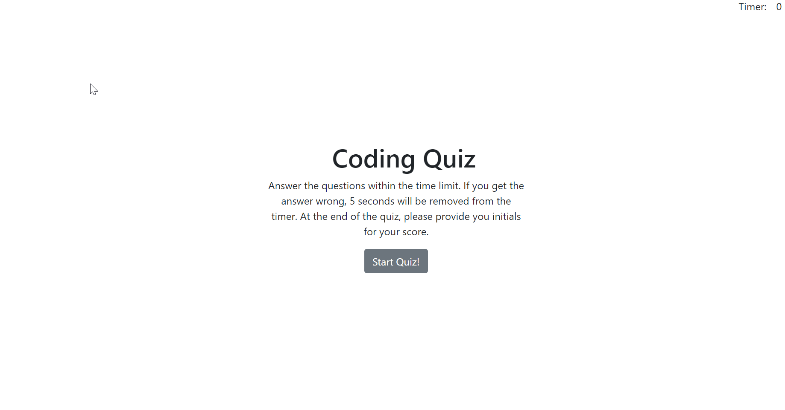

# Web-API: Code Quiz

## Description

This quiz was made for a homework assignment.  The code starts off with the first page where it intorduces the quiz and gives a brief description of what will happen if you get an answer wrong.  It is supposed to deduct 5 sec when an answer is wrong.

## Deployement

-Clone repo onto your machine and open the `index.html` page, or go to the live site here: https://equilinquin.github.io/Web-API/.

-Click the start button and the quiz will begin, and the time on the top right corner will start counting down.

-Every wrong answer will take 5 seconds away from time.

-Final score is the time left after all questions are answered.

-Final score will be recorded (if you want) to a display page.

## Built with

-HTML

-Bootstrap CSS

-Javascript

## Issues

-Not all questions are displayed till the very end.  If you notice, only 9 questions pop up when in the questions.js there are 10.  Still haven't been able to fix it.

-The localStorage is not remembering all highscores, and only lists what was last inputed (at the very end of the quiz only).

-There is no button to return to the quiz home page.

-The View High Score button does not work (Only can view high score at end of game).

## Image of deployed page

Link to deployable site: https://equilinquin.github.io/Web-API/